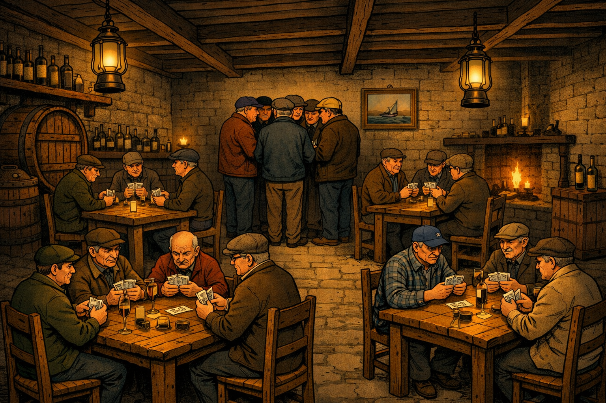

# C++RULLA 🎴

> An interactive desktop application developed in **C++** and **Qt** that implements the classic **Cirulla**, the traditional Genoese card game.



## 🚀 Key Features

* **Profile & Avatar Management:** Username entry with preliminary validation and optional loading of a custom profile image (avatar).
* **Hall of Fame (Leaderboard):** A dynamic statistical table tracking played matches and the win rate, automatically sorted using standard algorithms and enhanced with thumbnails and a customized podium.
* **Rules Section:** A dedicated window for quick consultation of the game rules integrated via read-only text components.
* **Customized Interface:** Themed dialog windows with custom backgrounds and styled stylesheets (QSS) for a cohesive visual experience.
* **Data Persistence:** Saving and loading game data using structured files (JSON).

## 🛠️ Technologies Used

* **Language:** C++ (modern standards)
* **GUI Framework:** Qt (Widgets, QTableWidget, QLayouts)
* **Structure:** Object-Oriented Programming (OOP) class architecture

## 📂 Project Structure

```text
cirulla/
├── src/
│   ├── main.cpp
│   ├── homeScreen.cpp / .h
│   ├── hallOfFameDialog.cpp / .h
│   ├── regoleDialog.cpp / .h
│   └── CharacterManager.cpp / .h
├── pictures/
│   └── cirulla-game-image.png
└── CMakeLists.txt (or .pro project file)

## ⚙️ Compilation and Execution

To compile and run the project, you need a development environment compatible with **Qt 5 or Qt 6** and a modern C++ compiler.

1. Clone the repository:
   ```bash
   git clone [https://github.com/acostahorn/ciapachinze](https://github.com/acostahorn/ciapachinze)

